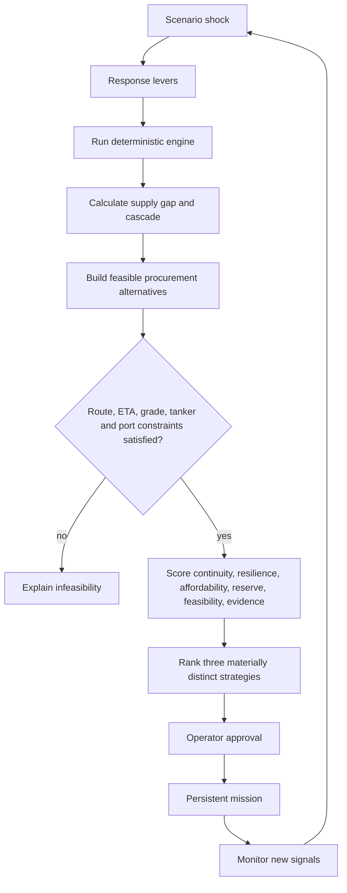
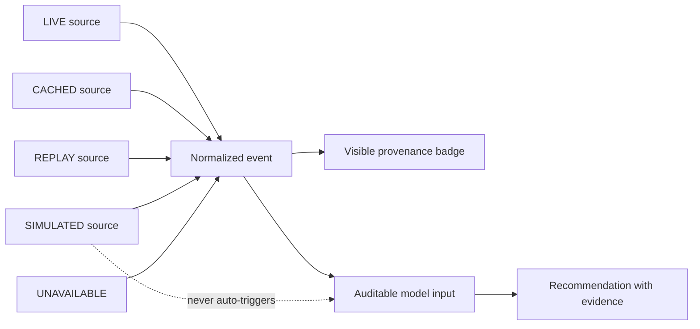
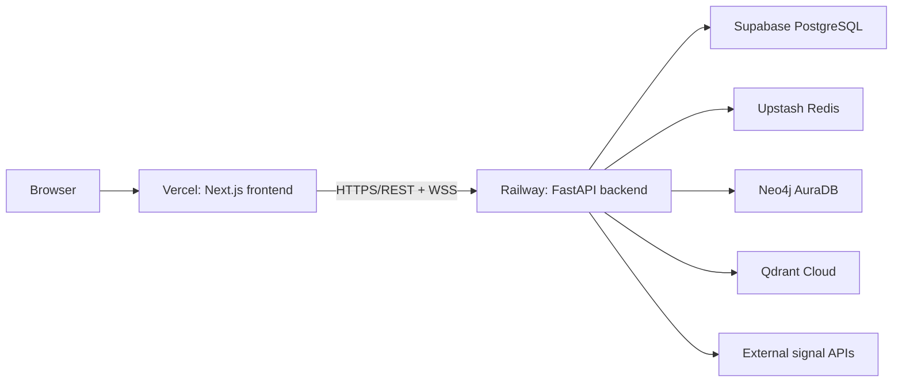

# CHANAKYA Architecture Diagrams

## A. Signal-to-mission sequence

```mermaid
sequenceDiagram
  participant S as Signal sources
  participant I as Ingestion service
  participant R as Risk scorer
  participant T as Digital twin/ontology
  participant X as Scenario engine
  participant C as Agent council
  participant D as Decision engine
  participant O as Operator

  S->>I: News, weather, market, AIS, sanctions, satellite
  I->>I: Normalize, deduplicate, stamp provenance
  I->>R: DomainEvent v1
  R->>T: Publish one OperationalSnapshot
  R->>O: Live risk feed and lead-time signal
  alt qualified incident crosses threshold
    R->>C: Auto-convene with exact snapshot
  else operator what-if
    O->>X: Select scenario and response levers
  end
  X->>X: Cascade supply, refinery, market and reserve impacts
  X->>C: Shared simulation context and cited evidence
  C->>D: Six typed lever proposals + disagreements
  D->>D: Search controls; re-simulate every candidate
  D->>O: Recommendation, alternatives, trade-offs, mission
  O->>D: Approve/activate with operator control
```

## B. Decision optimization loop



## C. Trust and provenance boundary



## D. Deployment topology


