# CHANAKYA — Complete Mermaid Architecture Pack

These diagrams describe the implemented prototype and its planned production topology. They can be copied into Mermaid Live Editor, GitHub Markdown, Notion, or documentation tooling that supports Mermaid.

## 1. System context diagram

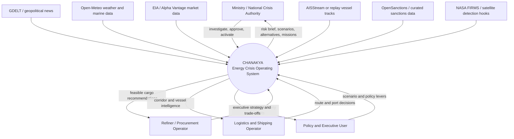

## 2. User roles and OOSE use-case diagram

Mermaid does not have a universal native UML use-case renderer, so this flowchart expresses the same OOSE structure: actors, system boundary, use cases, and include relationships.

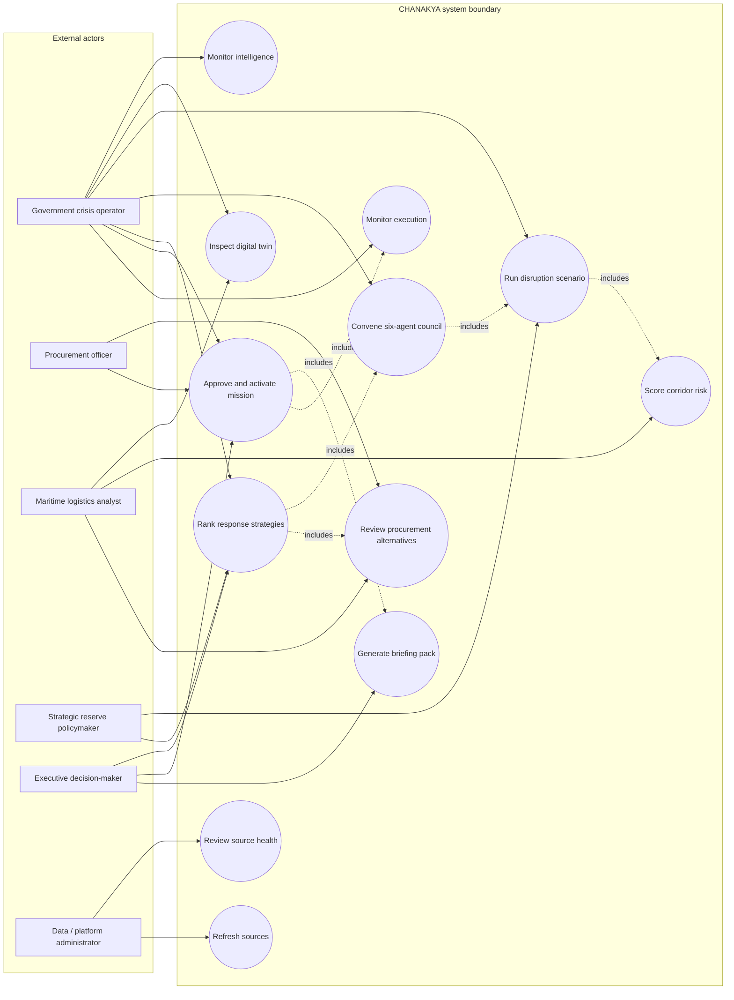

## 3. OOSE domain/object interaction diagram

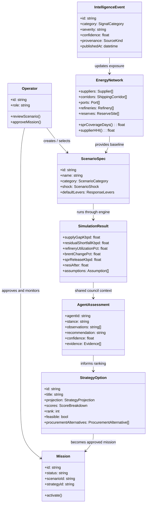

## 4. High-level layered architecture

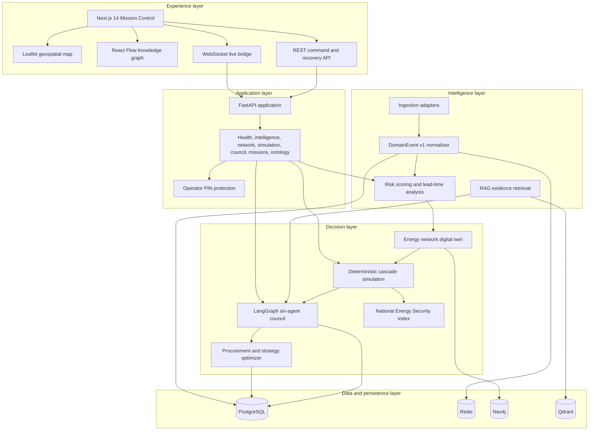

## 5. Detailed runtime/component diagram

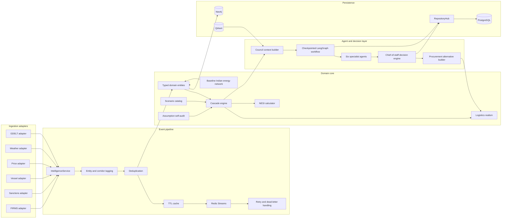

## 6. Deployment diagram

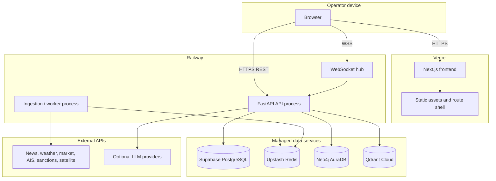

## 7. Data-flow diagram

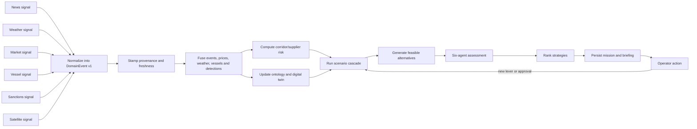

## 8. Signal-to-recommendation sequence diagram

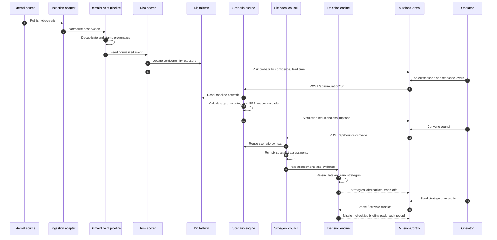

## 9. Scenario simulation activity diagram

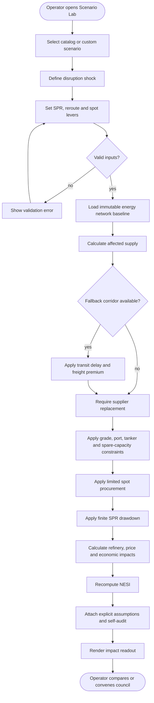

## 10. Mission lifecycle/state diagram

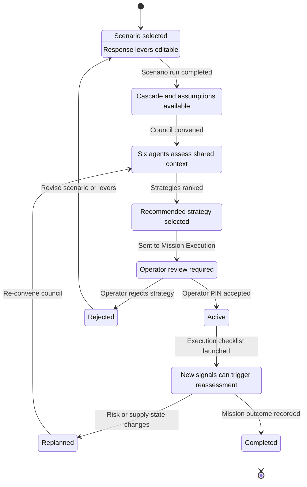

## 11. Entity relationship/data model diagram

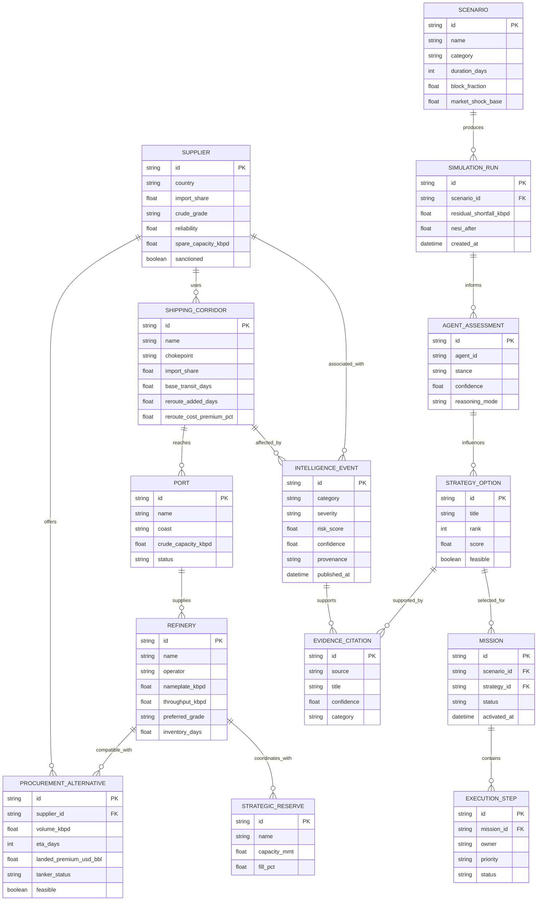

## 12. Knowledge graph topology

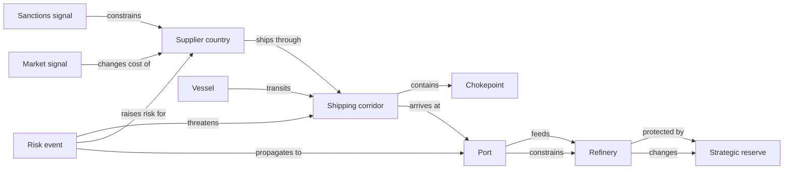

## 13. Security, trust, and provenance diagram

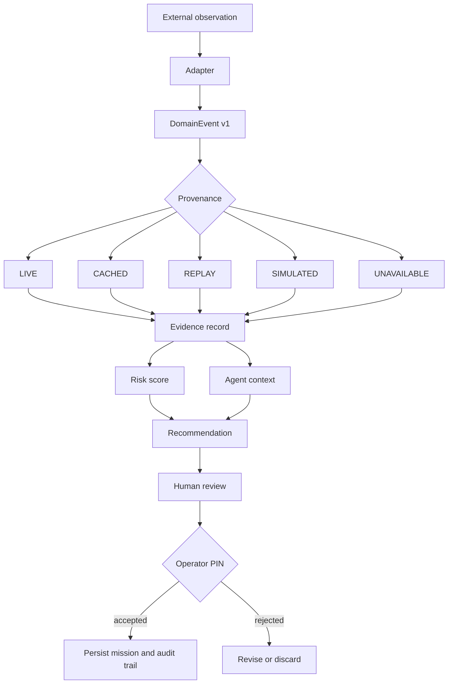

## 14. Optimization and objective scoring diagram

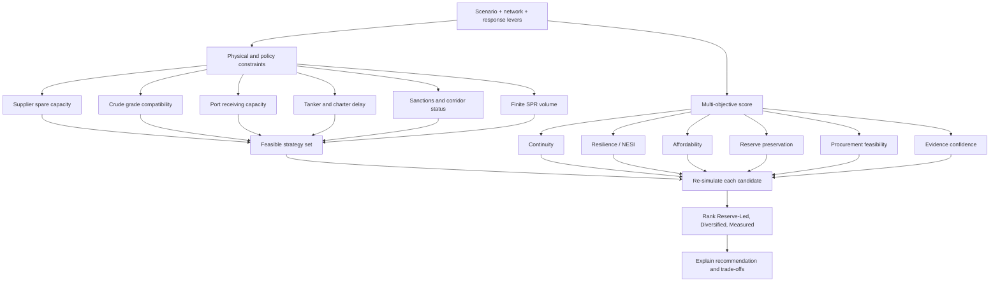

## 15. API/service interaction diagram

```mermaid
flowchart LR
    CLIENT[Next.js client]
    HEALTH[/api/health and /api/readyz/]
    INTEL[/api/intelligence/*/]
    NETWORK[/api/network and /api/graph/]
    SIM[/api/simulation/*/]
    COUNCIL[/api/council/convene/]
    WORKFLOW[/api/workflows/{run_id}/]
    MISSIONS[/api/missions/*/]
    SOURCES[/api/sources/status/]
    SOCKET[(WS /api/ws/intelligence)]

    CLIENT --> HEALTH
    CLIENT --> INTEL
    CLIENT --> NETWORK
    CLIENT --> SIM
    CLIENT --> COUNCIL
    CLIENT --> WORKFLOW
    CLIENT --> MISSIONS
    CLIENT --> SOURCES
    CLIENT <--> SOCKET

    INTEL --> INGEST[IntelligenceService]
    NETWORK --> TWIN[EnergyNetwork]
    SIM --> ENGINE[SimulationEngine]
    COUNCIL --> LANG[LangGraph Council]
    WORKFLOW --> REPO[RepositoryHub]
    MISSIONS --> REPO
    SOURCES --> STATUS[Source status registry]
```

## 16. Demo workflow diagram

```mermaid
flowchart LR
    A[Open CHANAKYA] --> B[Intelligence room]
    B --> C[Inspect Hormuz risk and evidence]
    C --> D[Digital Twin map / graph]
    D --> E[Scenario Lab: Hormuz closure]
    E --> F[Adjust SPR release]
    F --> G[View cascade and assumptions]
    G --> H[Convene six-agent council]
    H --> I[Compare three strategies]
    I --> J[Review feasible procurement alternatives]
    J --> K[Send to Mission Execution]
    K --> L[Activate mission]
    L --> M[Monitor timeline and briefing]
```
