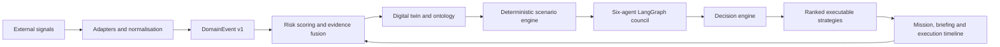
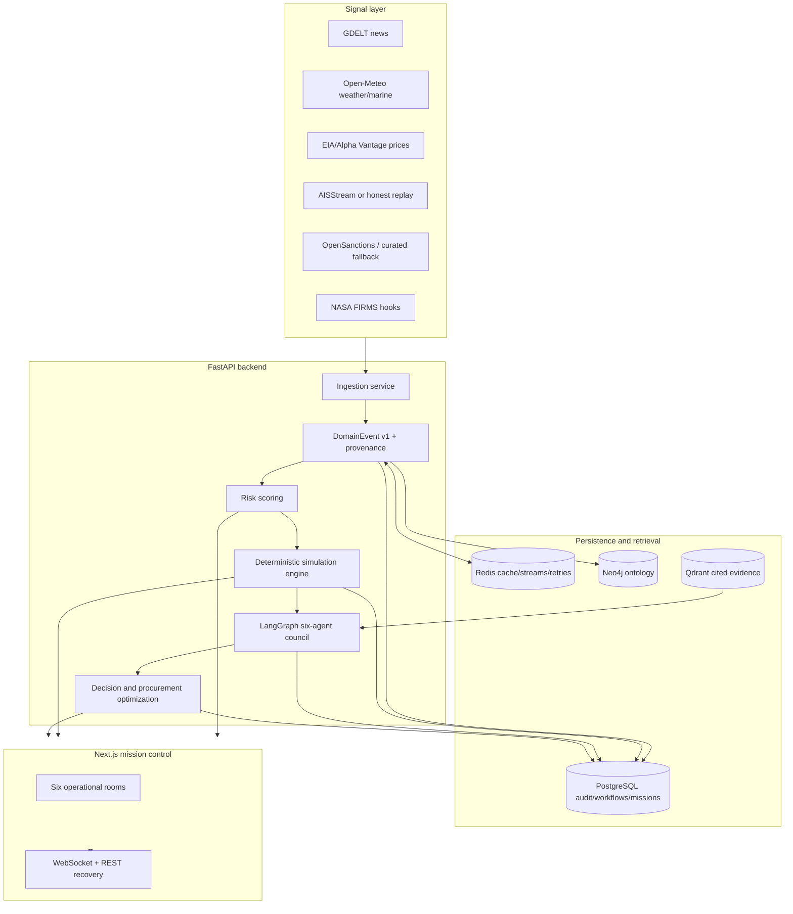

# CHANAKYA Platform Documentation

## 1. Product definition

CHANAKYA is an AI-powered Energy Crisis Operating System for India's crude-oil supply chain. It converts fragmented geopolitical, maritime, weather, sanctions, market, and satellite signals into an auditable response workflow:

**Observe → Understand → Predict → Simulate → Decide → Execute**

It is an operational intelligence platform, not a chatbot, static dashboard, or generic analytics portal.

## 2. The problem

India imports about 88% of its crude oil, while a large share of those imports depends on vulnerable maritime chokepoints. Traditional planning systems assume stable routes and periodic planning cycles. They do not continuously connect a geopolitical event to corridor exposure, refinery compatibility, reserve policy, economic impact, and executable procurement.

The operational gap is therefore not simply “lack of data.” It is the lack of a trusted decision layer that can answer, quickly and with evidence:

1. What is happening?
2. Why does it matter to India's energy network?
3. What happens under explicit disruption scenarios?
4. What should an operator do now, and what are the trade-offs?

## 3. What is implemented

| Capability | Current implementation |
|---|---|
| Intelligence fusion | GDELT, Open-Meteo, price adapters, sanctions, AIS/replay, satellite hooks; normalized events carry provenance |
| Digital twin | Seeded network of suppliers, corridors, ports, refineries, reserves, demand, and market state |
| Risk scoring | Corridor/supplier disruption probability, confidence, severity, lead-time, and structural exposure |
| Scenario engine | Hormuz closure, Red Sea suspension, OPEC+ cut, sanctions, cyclone, demand surge, plus custom scenarios |
| Cascade model | Supply gap, rerouting delay, spot replacement, SPR drawdown, refinery utilization, Brent, diesel, inflation/GDP proxies, NESI |
| Procurement | Grade compatibility, receiving capacity, route feasibility, ETA, port congestion, charter delay, tanker status, war-risk and landed premium |
| Agent council | Six specialist perspectives: intelligence, maritime, procurement, reserve, economic, policy |
| Decision engine | Three re-simulated strategies ranked by continuity, resilience, affordability, reserve, feasibility, and evidence |
| Execution | Persisted workflow/mission, operator PIN protection, checklist, crisis timeline, cabinet/procurement/SPR/advisory briefing views |
| Auditability | PostgreSQL records, Redis streams/cache/retries, Neo4j ontology, Qdrant cited corpus, assumptions endpoint, explicit source labels |

## 4. Platform links

- Local operator interface: `http://localhost:3100`
- Local API and OpenAPI documentation: `http://localhost:8010/docs`
- Local health: `http://localhost:8010/api/health`
- Source/provenance status: `http://localhost:8010/api/sources/status`
- Deployment target: Vercel frontend + Railway backend; use the actual deployed URL in the deck when available. Never invent a public URL.

## 5. End-to-end flow



## 6. Runtime architecture



## 7. Six operational rooms

1. **Global Intelligence** — ranked events, evidence, prices, weather, sanctions, and source freshness.
2. **National Energy Digital Twin** — Leaflet geospatial network and React Flow knowledge graph.
3. **Intelligence Council** — six agent assessments, confidence, evidence, and disagreements.
4. **Decision Center** — three ranked response strategies and objective breakdown.
5. **Scenario Simulation Lab** — shock definition, response levers, impact cascade, and assumptions.
6. **Mission Execution** — approved strategy, checklist, timeline, and briefing packs.

## 8. Optimization formulation

CHANAKYA treats response as constrained multi-objective optimization. For each scenario and lever set, it minimizes disruption while respecting physical and policy constraints:

```text
Minimize: unmet crude demand + economic cost + reserve depletion + route risk
Subject to: supplier spare capacity, crude-grade compatibility,
            port receiving capacity, tanker/charter delay, corridor status,
            sanctions constraints, finite SPR volume, and scenario duration
```

The decision engine compares three doctrines—Reserve-Led Stabilization, Market Diversification, and Measured Conservation—by re-running the same deterministic engine for each one. This makes the recommendation testable and makes trade-offs visible.

## 9. Data honesty and limitations

Every signal is labeled `LIVE`, `CACHED`, `REPLAY`, `SIMULATED`, or `UNAVAILABLE`. A replay vessel track is never presented as live AIS. No deck claim should say “fully live” unless the source status endpoint confirms it. Baseline network values and public figures are explicit model assumptions, not ground truth; `/api/simulation/assumptions` exposes the self-audit.

## 10. Demo acceptance path

1. Open the operator interface.
2. Inspect the Intelligence room and source labels.
3. Open Digital Twin and switch between map and graph.
4. Run **Hormuz Closure** in Simulation Lab; change the SPR lever.
5. Convene the Council and show six assessments plus disagreements.
6. Open Decision Center; compare three re-simulated strategies.
7. Send the recommended strategy to Execution, activate the mission, and show the checklist/timeline/briefing.

## 11. Verification status

- Frontend TypeScript check: expected command `pnpm typecheck`.
- Frontend production build: expected command `pnpm build`.
- Backend suite: `python3 -m pytest -q` after installing `backend/requirements.txt` in Python 3.12.
- In the current shell, frontend dependencies are available; backend test execution is blocked by missing Python packages in the active system interpreter. This is an environment issue, not evidence of a code failure.

## 12. Complete diagram source

See [MERMAID_ARCHITECTURE_PACK.md](MERMAID_ARCHITECTURE_PACK.md) for the full system-context, OOSE/use-case, object model, layered, component, deployment, data-flow, sequence, activity, state, ER, knowledge-graph, security, optimization, API, and demo-workflow diagrams.
